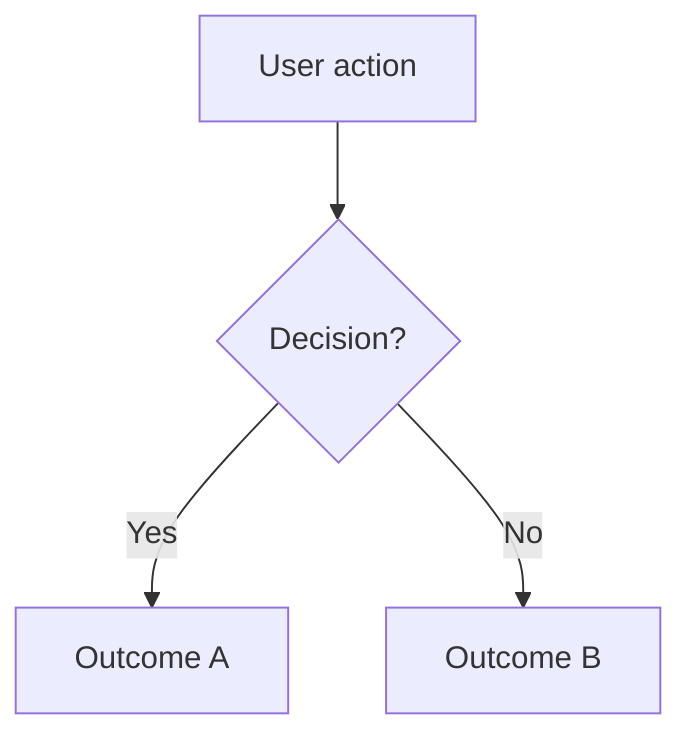

# Feature PRD Template

```markdown
# <Feature Name>

> Last updated: <date>
> Status: Draft | In Review | Approved | Implemented
> Version: v<N>
> Supersedes: [v<N-1>](./<previous-version>.md) *(omit for v1)*
> Parent PRD: [<Product Name>](../prd.md) *(omit if standalone feature)*

## Problem Statement

<1-2 sentences: What specific user problem does this feature address? Frame from the user's perspective.>

## Goals

1. <Goal — a specific, observable outcome this feature achieves>
2. <Goal>

## Non-Goals

- <Non-goal — a capability someone might expect this feature to include, but it won't>

## User Stories

### US-1: <Story Title>

**As a** <specific role>,
**I want** <capability — what the user does, not how it's built>,
**So that** <benefit — real value to the user>.

#### Acceptance Criteria

- [ ] Given <precondition>, when <action>, then <expected result>
- [ ] Given <precondition>, when <action>, then <expected result>

#### Notes

<Edge cases, constraints, clarifications — omit if none.>

### US-2: <Story Title>

...

## User Flow

<Mermaid flowchart of the primary user journey. Include decision points and error paths. Omit if the feature is a single-step action.>



## Non-Functional Requirements

<User expectations: responsiveness, availability, privacy, accessibility. Omit if none are notable.>

## Success Metrics

| Metric | Definition | Target |
|--------|------------|--------|
| <metric name> | <how it's measured> | <target value> |

## Risks & Mitigations

| Risk | Mitigation |
|------|------------|
| <what could go wrong> | <what we'll do about it> |

## Dependencies

<Other features, services, or decisions this depends on. Omit if standalone.>

## Glossary

| Term | Definition |
|------|------------|
| <term> | <plain-language definition> |

<Omit section only if all terms are self-explanatory.>

## Open Questions

- [ ] <Unresolved question needing stakeholder input>
```

