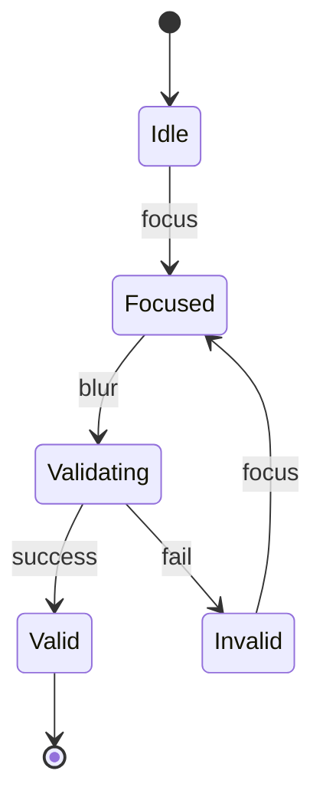

# Page Design: <Page Name>

**Date:** <YYYY-MM-DD>
**Author / Owner:** <name>
**Status:** Draft | In Review | Approved
**Related artifacts:**
- Website design: `<.product/design/websites/<slug>.md or N/A>`
- Design system: `<.product/design-system/... or N/A>`
- PRD / Spec: `<.product/define/specs/<feature>/v<N>.md or N/A>`
- User stories: `<.product/define/stories/<feature>/... or N/A>`

---

## 1. Page goal

A single sentence with a measurable outcome. Replace the placeholder — do not leave multiple co-equal goals.

- **Primary goal (one):** <e.g., "Convert a cold visitor into a demo request.">
- **Success signal (testable):** <e.g., "The user submits the demo form and sees the confirmation state.">
- **Secondary goals (demoted, optional):** <if any — name them, but they do not drive layout ranking>

---

## 2. Audience & JTBD

- **Primary persona(s) landing on this page (1-2):**
  - **<Persona A>** — <one-sentence description, how they arrive, what they bring>
  - **<Persona B (if applicable)>** — <…>
- **Top JTBD(s) for this page (1-3):**
  1. <When …, I want to …, so I can …>
  2. <…>
- **Entry points:** <how users arrive — search, deep link, in-product nav, email, email after signup, etc.>
- **Exit paths:** <where they go next — primary path and any secondary>

---

## 3. Archetype commitment

**Archetype:** <Landing | Dashboard | Form | List+detail | Article | Wizard | Settings | Empty/error | Hybrid: primary + secondary>

**Justification (1-2 sentences):** <why this archetype against the JTBDs and page goal above>

**Canonical states mandatory for this archetype (to be designed below):**
- <list the mandatory states for the chosen archetype — these drive the § 7 state catalog>
- <list the baseline states that always apply — loading, empty, error, success, disabled>

When the archetype's mandatory list and the baseline conflict, the baseline wins (a baseline `must` state is designed even if the archetype matrix does not name it).

---

## 4. Above-the-fold hierarchy

Ranked 3-5 elements that must live above the fold on desktop (600-800 px) and on mobile (500-700 px). Primary CTA must appear in the ranked set.

| Rank | Element | Purpose | Desktop placement | Mobile placement |
|---|---|---|---|---|
| 1 | <element> | <why this is #1> | <top-left / top-centered / full-width> | <same / sticky / hidden> |
| 2 | <…> | <…> | <…> | <…> |
| 3 | <…> | <…> | <…> | <…> |
| 4 | <…> | <…> | <…> | <…> |
| 5 | <…> | <…> | <…> | <…> |

**Primary CTA:**
- **Label:** <exact text>
- **Visual weight:** <solid high-contrast button | ghost | text link — name one>
- **Placement:** <where, above-the-fold specifically>
- **Mobile:** <inline | sticky bottom | duplicated in footer>
- **Disabled state:** <when disabled, what it looks like and what the tooltip says>

**Secondary CTAs (if any):** <name them; confirm they are visually demoted>

---

## 5. Wireframe (ASCII)

Low-fi wireframe per `references/wireframe-ascii-patterns.md`. Include the desktop and mobile variants.

**Desktop (xl, ~1200 px):**

```
<paste ASCII wireframe; annotate states and interactions inline>
```

**Mobile (sm, ~375 px):**

```
<paste ASCII wireframe; annotate reflow decisions>
```

---

## 6. Component composition

Every component referenced either maps to a design system primitive or is flagged for addition. Invented one-offs are not permitted.

| Region | Component | From | Notes |
|---|---|---|---|
| <header> | <Nav primary> | design system / <system-name> | <variant used> |
| <hero> | <Hero block> | design system / <system-name> | <variant used> |
| <cta> | <Button — primary variant> | design system | <size / emphasis> |
| <form> | <Input — text> | design system | <with inline validation> |
| <…> | <…> | <design system | page-local | NEEDS ADDITION> | <…> |

**Components needed but not in the design system (to add or deliberately keep page-local):**
- <name + short description + reason — e.g., "Inline-validation-toast: no equivalent in system yet; recommend adding via `harness:write-design-system` before this page ships.">

---

## 7. State catalog

Per data-driven region of the page, enumerate states and how they render. Walk `references/state-catalog.md` mandatory + archetype-conditional rows.

### Region: <name, e.g., "Primary content feed">

| State | Rendering | Interactions | Notes |
|---|---|---|---|
| Loading | <skeleton / spinner / progress> | <aria-busy; cancel-able after Ns> | |
| Populated | <default> | <canonical interactions> | |
| Empty (first-run) | <message + primary action> | <CTA path> | |
| Empty (filtered) | <message + clear-filters> | <CTA path> | Distinct from first-run |
| Error (fetch failed) | <inline message + retry> | <retry in place> | |
| Permission-denied | <locked affordance + explanation> | <request-access path> | |
| <…> | <…> | <…> | <…> |

### Region: <next region>

<repeat>

---

## 8. Interactions

For each element in the above-the-fold ranking and each interactive region, specify: trigger, response, affordance, keyboard equivalent. For multi-step interactions, include a mermaid `stateDiagram-v2`.

| Element | Trigger | Response | Affordance | Keyboard equivalent |
|---|---|---|---|---|
| Primary CTA | Click / Tap / Enter | <navigation / inline modal / toast> | <cursor pointer, color change on hover, focus ring> | Tab to reach + Enter |
| <Field X> | Focus + input | <inline validation on blur> | <label animates / floats; error underlines> | Tab to field |
| <Menu Y> | Click | <dropdown panel opens> | <chevron rotates> | Enter opens, Esc closes, Arrow keys navigate |
| <…> | <…> | <…> | <…> | <…> |

**Multi-step interaction diagram (if applicable — for menus, modals, forms with async validation):**



---

## 9. Responsive behavior

Breakpoint set (from `references/responsive-patterns.md` or the design system):
- **sm:** 0-639 px · **md:** 640-767 · **lg:** 768-1023 · **xl:** 1024-1279 · **2xl:** 1280+

Strategy: <mobile-first | desktop-first>

| Region | sm (phone) | md | lg (tablet) | xl (desktop) | 2xl |
|---|---|---|---|---|---|
| <region A> | <pattern: stack / collapse / hide / swap / resize> | <…> | <…> | <…> | <…> |
| <region B> | <…> | <…> | <…> | <…> | <…> |

**Touch affordances:** <hover substitutes; target size ≥44×44 px confirmed for primary actions on sm/md>

**Orientation:** <whether landscape on tablet changes layout>

---

## 10. Accessibility

WCAG tier: **AA** (default) | **AAA** <where elevated>

- **Heading hierarchy:** <outline — `h1: <page title>` → `h2: <main sections>` → `h3: <subsections>`>
- **Landmark regions:** <`<header>`, `<nav>` (labeled: "Primary"), `<main>`, `<aside>` (if used, labeled), `<footer>`>
- **Focus order (first 5-10 tab stops):**
  1. <Skip-to-content link>
  2. <…>
- **Contrast commitments:** body text <ratio>:1; primary CTA <ratio>:1; dark-mode parity maintained
- **Target sizes on mobile:** primary actions ≥44×44 px; minimum touch target ≥24×24 px (WCAG 2.2 SC 2.5.8)
- **Motion policy:** `prefers-reduced-motion` respected — <what the reduced alternative is>
- **Dynamic regions:** <which regions are `aria-live` and at which priority>
- **Screen-reader narrative (how the page reads top-to-bottom):** <brief description>
- **Per-archetype gotchas confirmed:** <list the specific gotchas that apply to this archetype — e.g., for Form: no placeholders-as-labels, aria-describedby on errors, submit-button loading state>

---

## 11. Edge cases

Walk the archetype-specific edges plus the cross-archetype baseline. Decide *handle* / *defer with reason*.

| Edge case | Handling |
|---|---|
| 404 / 403 landing (user arrives at wrong URL for a gated page) | <redirect / inline error / error page> |
| Offline (client loses connection mid-session) | <cached fallback / retry banner / read-only mode> |
| Slow network (fetch >5s) | <progress indicator / skeleton / cancel affordance> |
| JS disabled | <content still readable + primary action works server-side, or gracefully degrades> |
| Third-party widget blocked (analytics, chat, embeds) | <silent fallback; page still functional> |
| Rate-limited / throttled | <inline message with retry countdown> |
| Stale auth / session expired | <inline renew flow or redirect to sign-in with return-to> |
| <archetype-specific edge 1> | <handling> |
| <archetype-specific edge 2> | <handling> |

---

## 12. Metrics & events

Analytics and observability hooks to embed at implementation time. Keeps page-design grounded in a measurable outcome.

- **Primary success event:** <the event that fires when the page goal is achieved>
- **Secondary events:** <CTA clicks, form field interactions, state transitions worth tracking>
- **Error telemetry:** <what errors are logged and with what context>
- **Performance budget:** <LCP target, INP target, CLS target — if declared in the website-design artifact, inherit>

---

## 13. Open questions

Numbered list of unresolved decisions, with the cost of leaving them open and the proposed resolution path.

1. **<Question>** — <why it matters, what's blocked> · *Proposed resolution:* <user research / decision owner / data needed>.
2. <…>

---

## 14. Hand-offs

| Next step | Skill / artifact |
|---|---|
| Visual design system (tokens, typography, components) | `harness:write-design-system` |
| Feature backend/frontend architecture | `design:design-spec` per feature on this page |
| Website structure / IA (if upstream) | `design:design-website` |
| Implementation scaffolding | `build:scaffold-project` |
| Break this page's features into backlog stories | `define:write-user-story` |
| Decide what to build first if the page is large | `define:slice-mvp` |

---

## Changelog

| Date | Change | Author |
|---|---|---|
| <YYYY-MM-DD> | Initial draft | <name> |
