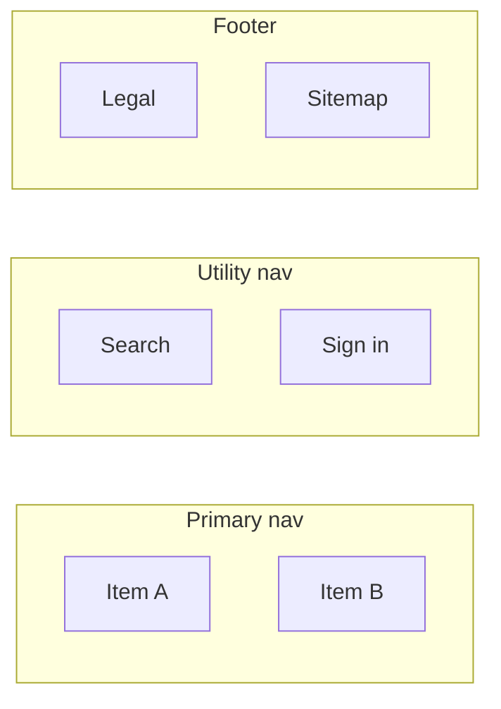
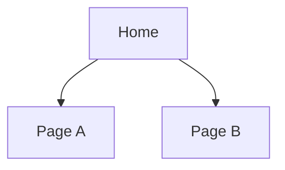

# Website Design: <Site Name>

**Date:** <YYYY-MM-DD>
**Author / Owner:** <name>
**Status:** Draft | In Review | Approved
**Related artifacts:**
- Opportunity: `<.product/discover/opportunities/<slug>.md or N/A>`
- PRD / Spec: `<.product/define/specs/<feature>/v<N>.md or N/A>`
- Design system: `<.product/design-system/... or N/A>`

---

## 1. Strategy preamble

A short paragraph framing the project. Replace each placeholder; do not leave any blank — explicit "TBD" with an Open Question is better than silence.

- **Site type:** <Marketing | SaaS | E-commerce | Content | Docs | Portfolio | Community | Internal | Hybrid: primary + secondary>
- **Primary users (2-4):**
  - **<Persona / role A>** — <one-sentence description, including how they arrive>
  - **<Persona / role B>** — <…>
- **Top user JTBDs (3-5, ordered by frequency or importance):**
  1. <When …, I want to …, so I can …>
  2. <…>
  3. <…>
- **Primary business outcome (one metric):** <e.g., "qualified demo requests / month," "trial-to-paid conversion," "weekly active users," "support-ticket deflection rate">
- **Constraints:** <tech stack, CMS, framework, performance budget, SEO/SSR, localization, accessibility tier, timeline>
- **Out of scope:** <surfaces not covered by this design — e.g., the in-product app surface, the marketing micro-sites, the embed widget>

---

## 2. Site type & nav paradigm commitment

**Site type:** <chosen type, justified in 1-2 sentences against the JTBDs above>

**Navigation paradigm:** <one choice — top nav | side nav | hybrid top + side | search-first | command-palette-primary>

| Region | Items | Notes |
|---|---|---|
| Primary nav | <comma-separated top-level items> | <justification — why these, why this many> |
| Utility nav | <search, login, sign-up CTA, notifications, locale switcher, etc.> | |
| Footer | <company, legal, status, sitemap, social> | |
| Side / contextual nav | <if used; else N/A> | |

**Mermaid diagram of the nav model:**

---

## 3. Sitemap

A `flowchart TD` showing every page in the inventory and how it nests. For sites with >25 pages, split into multiple sitemaps (one per top-level section) and link them.

---

## 4. Page inventory

Each page tied to a JTBD and a content type. Add rows for every page in the sitemap above; do not stop at the happy path.

| Page name | URL | Purpose (JTBD it serves) | Content type | Auth | Owner template |
|---|---|---|---|---|---|
| Home | `/` | <which JTBD does this serve?> | static / dynamic feed / app view | public | home.tmpl |
| <…> | <…> | <…> | <…> | <…> | <…> |

**Content types reference:** `static` (one source file), `dynamic template` (one template, many records), `app view` (authenticated, data-driven), `external` (link out).

---

## 5. URL / route shape

Either a markdown table or a `flowchart TD` of the route tree. Use the table when the route tree has ≤15 routes with no nested sub-paths; use the diagram when there are >15 routes or multi-level nesting. Do not render both for the same content.

| Route | Page | Auth | Notes |
|---|---|---|---|
| `/` | Home | public | |
| `/<segment>` | <Page> | <public | authed | role-gated> | <e.g., role: admin> |

---

## 6. Cross-page user flows

The 3-5 highest-leverage journeys. Each flow gets a heading, a one-line success condition, and a mermaid diagram. Do not include flows that fit on a single page — those belong in page-level design.

### Flow 1: <Who → what → success condition>

**Success condition:** <e.g., "First project created within 5 minutes of signup">
**Trigger:** <how the user enters this flow>

### Flow 2: <…>

<repeat>

---

## 7. Edge pages

For each category, list pages included and one-line justifications for any meaningful exclusions. See `references/edge-pages-checklist.md` (in the skill) for the catalog and the include/exclude matrix.

| Category | Included | Excluded with reason |
|---|---|---|
| Errors (404, 500, 403) | 404, 500 | 403 — no auth-gated routes in this surface |
| Auth | Sign in, Sign up, Forgot password | MFA — not on roadmap for v1 |
| Empty states | List view empty, search-no-results | |
| Confirmations | Sign-up complete, contact thank-you | |
| System state | Status page (separate subdomain) | Maintenance — handled via banner instead |
| Legal | Privacy, Terms, Cookie policy | Sub-processors — not B2B |
| Localization | EN only at launch | |

---

## 8. Design principles for this site

A short list of opinionated calls a reviewer should be able to test the implementation against. 3-7 items.

- <e.g., "Search-first navigation: primary discovery happens via the search bar, not the top nav. Top nav is intentionally minimal.">
- <e.g., "Every PDP is a landing page; do not depend on the home page for context.">
- <e.g., "Pricing page is reachable from primary nav from every page.">

---

## 9. Open questions

Numbered list of unresolved decisions, with the cost of leaving them open and the proposed resolution path. Do not bury blockers in prose.

1. **<Question>** — <why it matters, what's blocked> · *Proposed resolution:* <user research / decision owner / data needed>.
2. <…>

---

## 10. Hand-offs

| Next step | Skill / artifact |
|---|---|
| Page-level UI/UX design | `design:design-page` |
| Feature tech specs | `design:design-spec` per feature |
| Design system (tokens, type, components) | `harness:write-design-system` |
| Implementation scaffolding | `build:scaffold-project` |
| Release planning | `define:slice-mvp`, `define:write-prd` |

---

## Changelog

| Date | Change | Author |
|---|---|---|
| <YYYY-MM-DD> | Initial draft | <name> |
