# Sitemap & Flow Mermaid Patterns

Templates and worked examples for the mermaid diagrams that appear in every website-design artifact: the sitemap, the navigation model, and the cross-page user flows. Pick the diagram type that matches the intent — do not force a single shape onto every diagram.

## Contents

1. [Diagram-type selection](#diagram-type-selection)
2. [Sitemap pattern](#sitemap-pattern)
3. [Navigation model pattern](#navigation-model-pattern)
4. [Cross-page user flow patterns](#cross-page-user-flow-patterns)
5. [URL / route shape](#url--route-shape)
6. [Worked examples](#worked-examples)

## Diagram-type selection

| Intent | Mermaid type |
|---|---|
| Page hierarchy / sitemap | `flowchart TD` (top-down tree) |
| Navigation grouping (primary / utility / footer) | `flowchart LR` with subgraphs per nav region |
| Linear user flow across pages | `flowchart LR` |
| Branching user flow with decisions | `flowchart TD` with diamond decision nodes |
| Authenticated request/response sequence | `sequenceDiagram` |
| Page lifecycle / auth-state transitions | `stateDiagram-v2` |
| URL / route nesting | `flowchart TD` with subgraphs per route segment |

When in doubt: `flowchart` for structure, `sequenceDiagram` for time-ordered interaction, `stateDiagram-v2` for status changes.

## Sitemap pattern

A sitemap is a tree of pages. Use `flowchart TD`. Group by nav region (primary, utility, footer) using subgraphs when the structure is non-trivial.

**Minimal pattern:**

````markdown
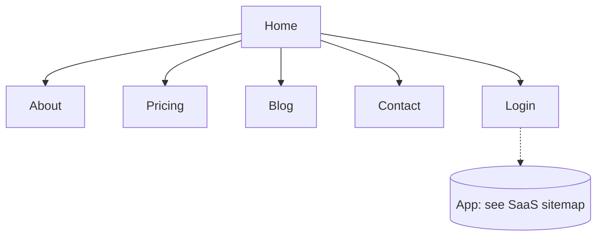
````

**Rules.**
- One node per *page*, not per nav item.
- Use `[Square brackets]` for normal pages, `[(Stadium)]` for collections (blog feed, article list), `{{Hex}}` for app/external surfaces, `[/Trapezoid/]` for forms.
- Solid arrows for in-IA links; dotted arrows (`-.->`) for hand-offs to a different surface (auth, external, app).
- Annotate dynamic templates explicitly: `BlogPost[Blog post: per-post]`.
- When the tree exceeds ~25 nodes, split into multiple sitemaps (e.g., one per top-level section).

## Navigation model pattern

Show the *commitment* — which nav region holds what. Use `flowchart LR` with subgraphs per region.

````markdown
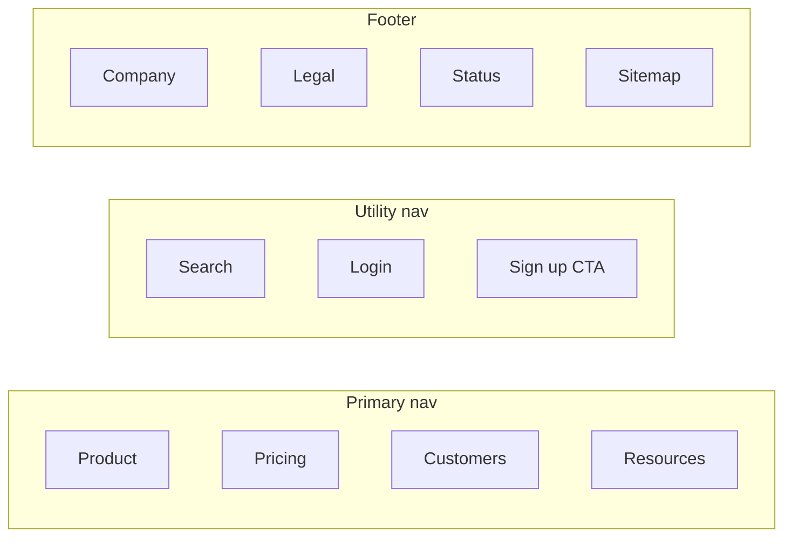
````

**Rules.**
- One subgraph per nav region: Primary, Utility, Footer, Side (for SaaS / docs), Mega (if used).
- Only show top-level entries; nested mega-menu children belong in the sitemap.
- Mark contextual nav (in-page TOC, breadcrumbs) in prose, not in this diagram.

## Cross-page user flow patterns

A flow walks one user, with one goal, across the pages required to reach it. Each flow gets its own diagram. Use `flowchart LR` for linear flows and `flowchart TD` with decision diamonds for branching flows.

**Linear flow:**

````markdown
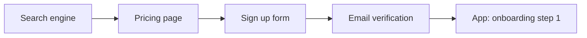
````

**Branching flow:**

````markdown
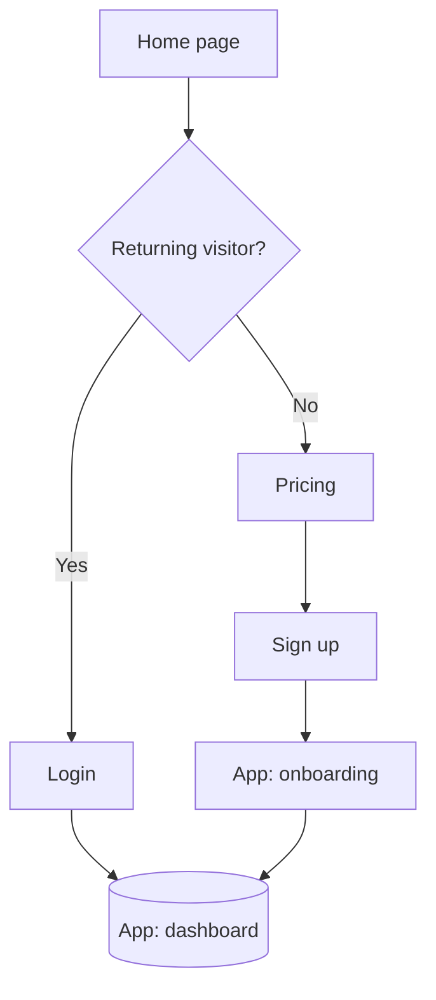
````

**Sequence variant** — when the flow is dominated by interaction (auth handoffs, payment callbacks, OAuth), prefer `sequenceDiagram`:

````markdown
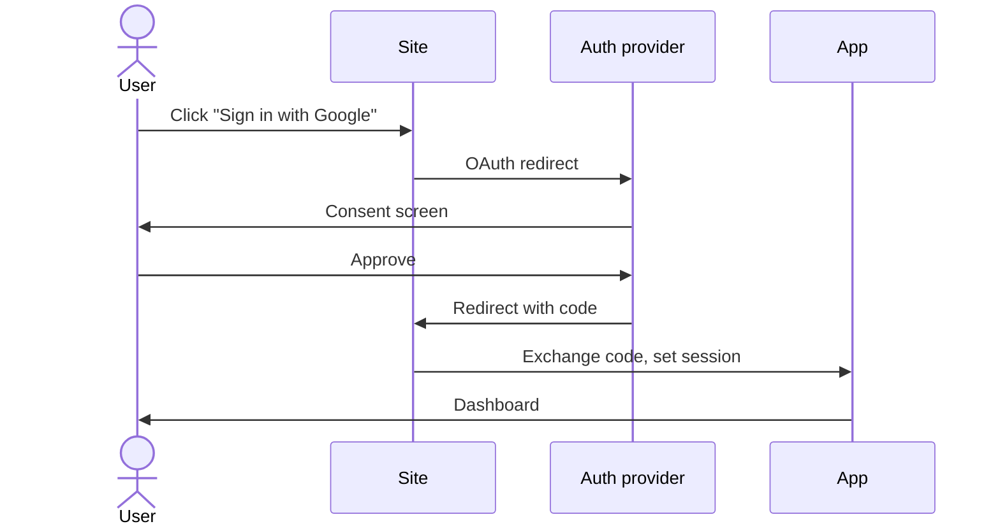
````

**Rules.**
- Title each flow above the diagram: who, what, success condition. Example: `### Flow: New visitor signs up and reaches first project (success = first project created within 5 minutes).`
- One success path per diagram; show alternates in prose below.
- Top 3-5 flows max per artifact. More than that is a sign the site is doing too much and IA needs decomposition.
- Link nodes to sitemap nodes by name (use the same labels) so the reader can cross-reference.

## URL / route shape

Use a `flowchart TD` with subgraphs per route segment for non-trivial route trees. Annotate auth-gating in node text.

````markdown
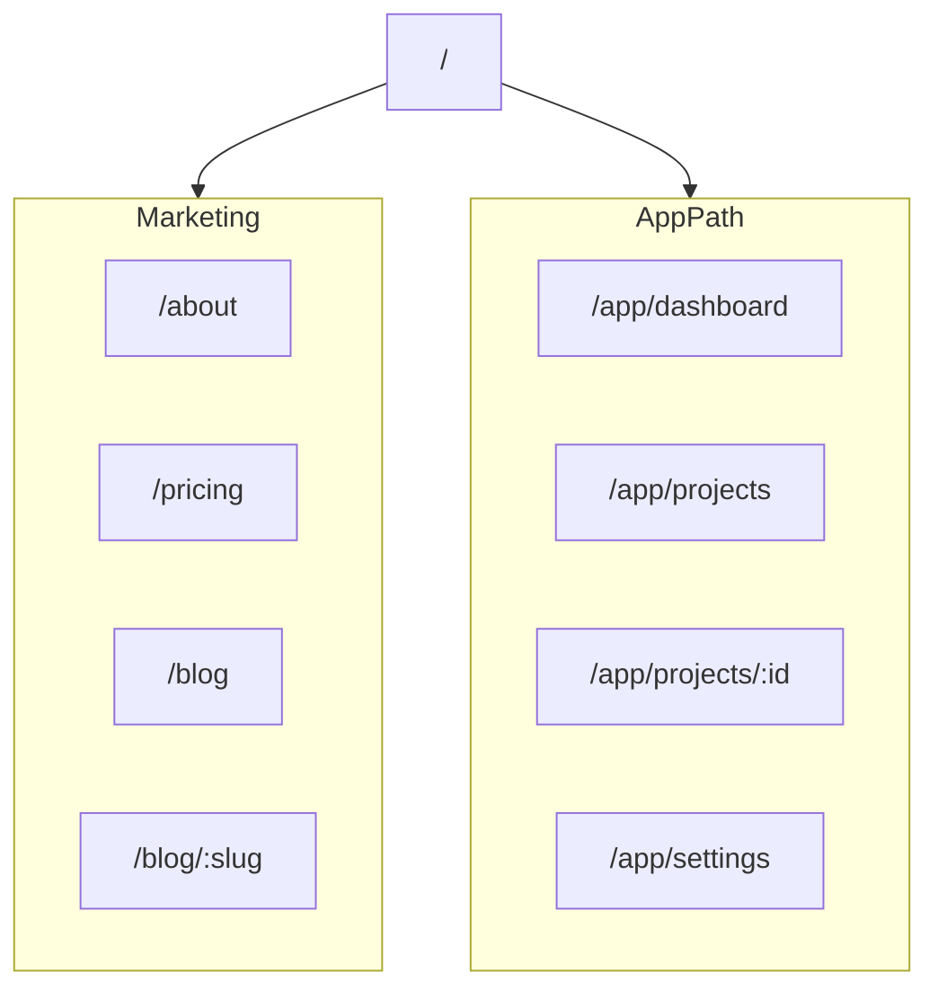
````

For simple sites, a markdown table is often clearer than a diagram:

```markdown
| Route | Page | Auth |
|---|---|---|
| `/` | Home | public |
| `/pricing` | Pricing | public |
| `/blog` | Blog feed | public |
| `/blog/:slug` | Blog post | public |
| `/login` | Login | public |
| `/app/dashboard` | Dashboard | authed |
| `/app/projects/:id` | Project detail | authed |
```

Decision rule: use the table when the route tree has ≤15 routes with no nested sub-paths; use the `flowchart TD` when there are >15 routes or multi-level nesting. Do not render both for the same content.

## Worked examples

### Example A: Marketing site (8 pages, single nav)

````markdown
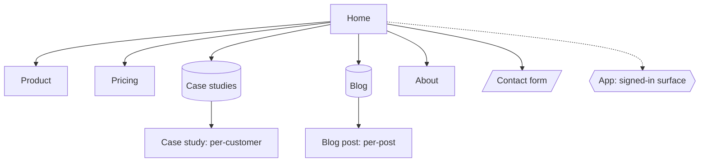
````

### Example B: SaaS app sitemap (signed-in surface only)

````markdown
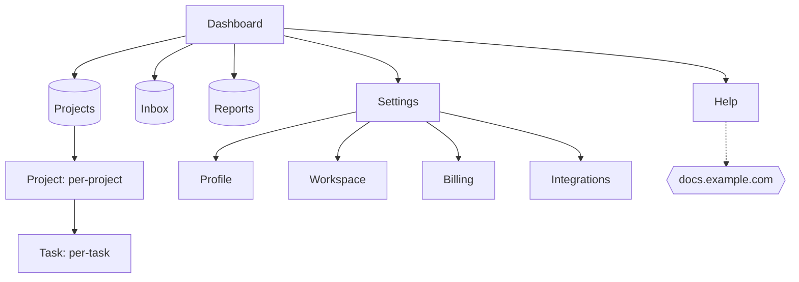
````

### Example C: Top SaaS flow (sign-up → first task)

````markdown
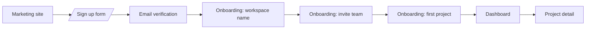
````

### Example D: E-commerce critical conversion flow

````markdown
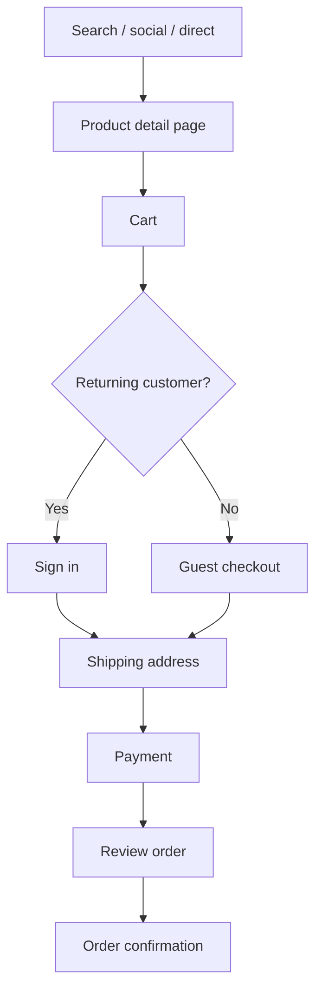
````

### Example E: Docs site nav model

````markdown
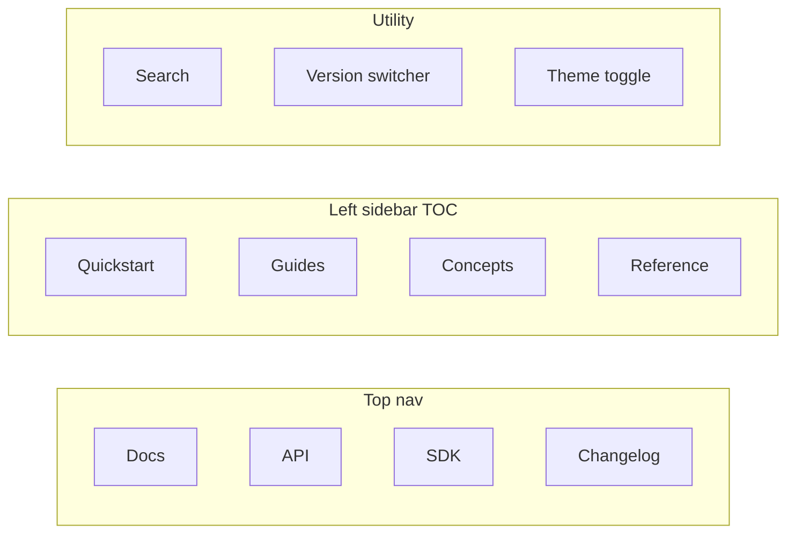
````
