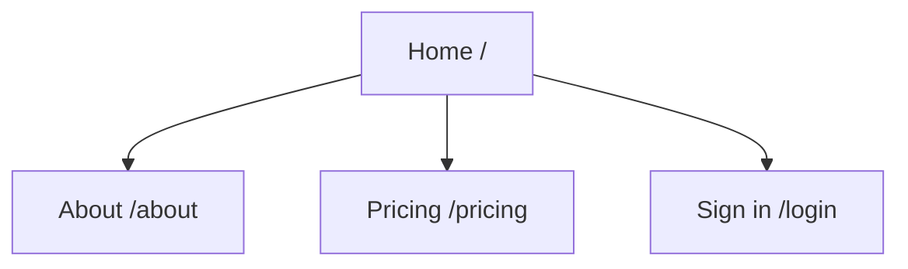

# Write Sitemap

## Process

1. **List the pages** — every page the site has, with URL and one-line purpose. Include edge pages (404, auth, legal) explicitly.
2. **Draw the sitemap** — `flowchart TD` showing how pages link from home.
3. **Write the file** — fill the template below at `.product/design/sitemap.md`.

## Hard constraints

- **Pages only.** No JTBDs, business outcomes, nav paradigms, design principles. Those live in `define:write-product-md` or `harness:write-design-system`.
- **One file per site.** Multi-surface products (marketing + app + docs) suffix the filename: `sitemap-marketing.md`, `sitemap-app.md`.

## Template

````markdown
# Sitemap

**Updated:** <YYYY-MM-DD>

## Page inventory

| Page | URL | Purpose |
|---|---|---|
| Home | `/` | Entry point |
| | | |

## Sitemap



## Edge pages

- **Errors:** 404, 500
- **Auth:** sign in, sign up, forgot password
- **Legal:** privacy, terms
- **Empty / no-results states:** <list any non-trivial ones>

Decide each category explicitly. Note any deliberately excluded with a one-line reason.
````
