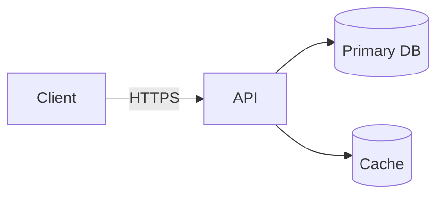
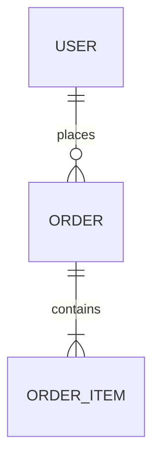
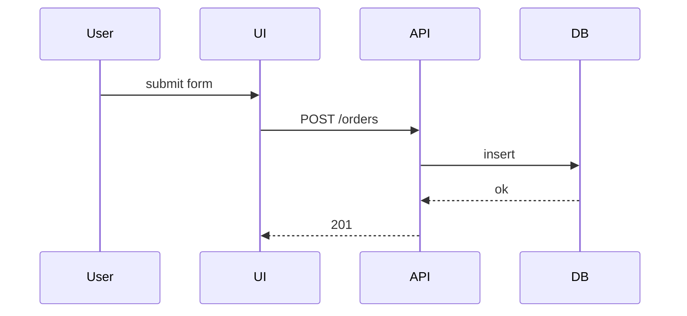

# [Feature] - Technical Specification

**Status:** Draft | In Review | Approved
**Scope:** Backend | Frontend | Full-stack
**PRD:** <path or N/A>

## 1. Context

1–2 lines on the problem and why this design exists. Link the PRD for goals, non-goals, and user stories — do not restate them here.

## 2. Architecture

One paragraph + a mermaid `flowchart`. Full-stack: client → server → store hops. Frontend-only: component or feature-module layout.

## 3. Data Model

*Skip if no persisted state.* Show entities and key fields. List indexes that matter for query patterns. No DDL.

| Entity | Field | Type | Constraints |
|--------|-------|------|-------------|
| Order | id | UUID | PK |
| Order | user_id | UUID | FK → User, indexed |
| Order | status | enum | NOT NULL, default `pending` |

## 4. Contracts

*Skip if no external interface.*

### Backend endpoints (when applicable)

| Method | Path | Purpose | Auth |
|--------|------|---------|------|
| POST | `/api/v1/orders` | Create order | User |

Response shapes per endpoint (no full JSON):

| Status | Meaning | Shape |
|--------|---------|-------|
| 201 | Created | `{ id, status, total_amount }` |
| 4xx | Validation / auth / conflict | `{ error.code, error.message }` |

### Frontend routes (when applicable)

| Route | Renders | Auth | Key states |
|-------|---------|------|------------|
| `/orders` | Order list | User | loading, empty, populated, error |

## 5. Behavior

*Skip if trivial.* Sequence diagram for request/response flow, state diagram for entity lifecycle.

## 6. Trade-offs & Alternatives

| Decision | Trade-off | Rationale |
|----------|-----------|-----------|
| | | |

**Alternatives considered:**

- **Alt 1:** approach / why rejected
- **Alt 2:** approach / why rejected

## 7. Edge Cases & Risks

Only the relevant ones. Drop subsections that don't apply.

**Edge cases**

| Scenario | Handling |
|----------|----------|
| | |

**Security** — auth/authorization, input validation, secrets handling. Only what's specific to this feature.

**Performance** — budgets and how they're verified. Only when relevant.

**Migration** — required for any schema/API/route change: how do existing clients, URLs, or stored data survive?
