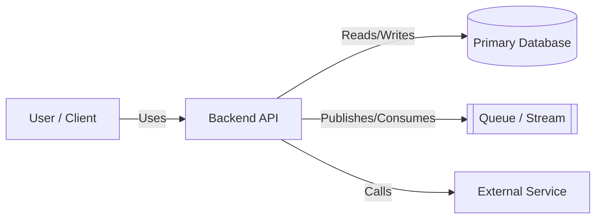
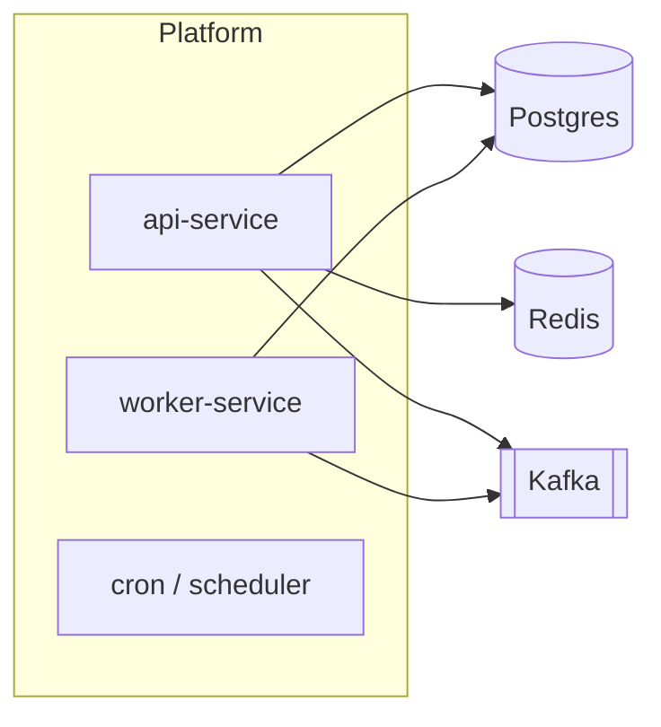
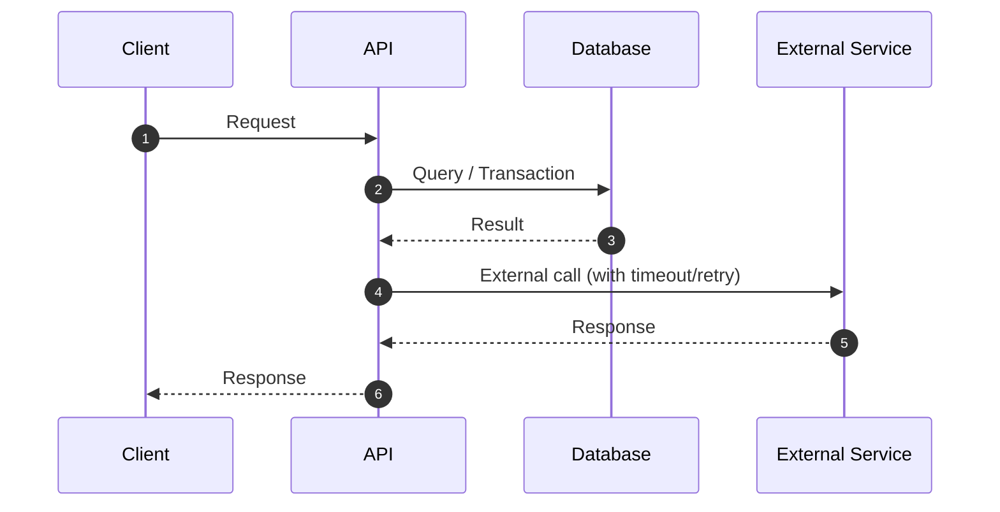

# Mermaid Diagram Templates (C4-Style)

Adapt these templates to the repo’s actual services and data flows.

## System Context (C4-Style)

## Container / Service Topology

## Sequence Diagram (Critical Flow)

